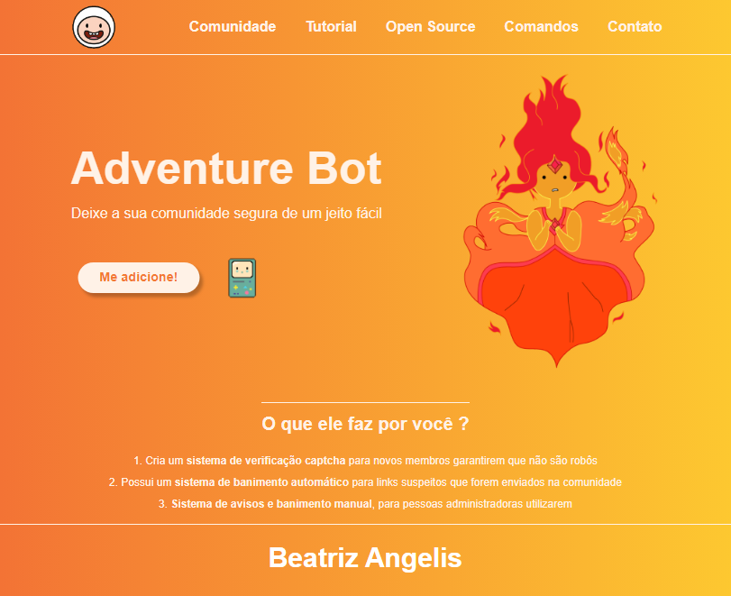

# Landing page - Adventure Bot

O Adventure bot saiu de um desafio da influenciadora Rafaela Ballerini, o objetivo era criar o que seria uma landing page de um bot para discord.

## Abaixo algumas imagens e gifs sobre o projeto

- Animações no botão "Me Adicione", links e no BMO.

# Links

- Link do vídeo no Youtube: https://lnkd.in/d3AiqzU4
- Link para a página do Balle Bot: https://balle-bot-aleviannaf.vercel.app/
- Link para o repositório: https://github.com/rafaballerini/LandingPage

## 🛠 Tecnologias utilizadas

- HTML
- CSS

## 📖 O que aprendi

- Conheci novas animações utilizando o CSS
- Boas práticas na escrita do HTML e CSS
- Aprendi novas tags do CSS
